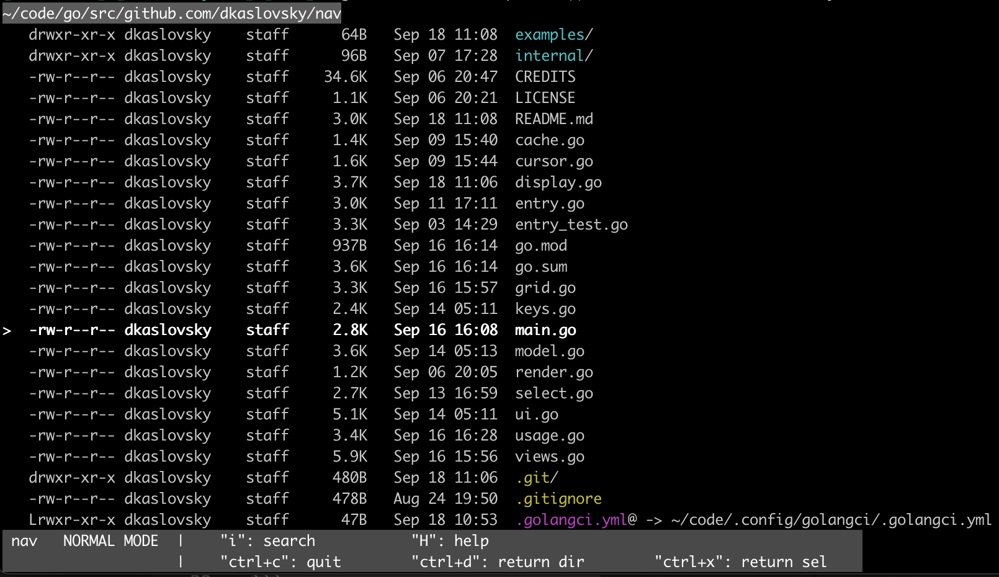

# nav
Terminal navigator for interactive `ls` workflows.




<br/>

## Overview

`nav` is a terminal filesystem explorer built for interactive `ls` workflows.
It can be used as a standalone TUI or in bash/zsh functions such as

<table>
<tr>
<td>

```bash
# interactive ls + cd
function nv {
	cd "$(nav --pipe "$@")"
}
```

</td>
<td>

```bash
# interactive ls + clipboard
function ncp {
	nav --pipe "$@" | pbcopy
}
```

</td>
</tr>
</table>


`nav` is intended to be an interactive replacement for `ls` and currently supports some of the most common `ls` options:
<table>

<tr>
<td>

long list with full details

</td>

<td>

`ls -l`

</td>

<td>

`nav --list` / `nav -l`

</td>
</tr>

<tr>
<td>

show hidden files

</td>
<td>

`ls -a`

</td>

<td>

`nav --hidden` / `nav -a`

</td>
</tr>

<tr>
<td>

follow symlinks

</td>

<td>
</td>

<td>

`nav --follow` / `nav -f`

</td>
</tr>

</table>

These options are available as interactive toggles and can also be invoked on start with the appropriate command line flag ([see below](#full-list-of-commands)).

Human readable file sizes (`ls -lh`), color output (`ls --color`), and a custom sort order are on by default and cannot currently be configured.

In the future, `nav` might support a wider range of `ls` options and configuration.

<br/>

### Full list of commands

	Arrow keys are used to move the cursor.
	Vim navigation is available using "h" (left), "j" (down) "k" (up), and "l" (right).

	"enter":       navigates into the directory or returns the
	               path to the entry under the cursor
	"backspace":   navigates back to the previous directory

	"ctrl+x":      returns the path(s) to the current entry or all marked entries
	"ctrl+d":      returns the path to the current directory

	"i":           enters search mode (insert into the path)
	"d":           enters debug mode  (view error details)
	"H":           enters help mode
	"esc":         switches back to normal mode or clears marked entries

	"m":           marks an entry for multiselect return
	"ctrl+a":      marks all entries for multiselect return

	"a":           toggles showing hidden files (ls -a)
	"L":           toggles listing full file information (ls -l)
	"f":           toggles following symlinks

	"e":           dismisses errors
	"ctrl+c":      quits the application with no return value

<br/>

### Command line flags

	--help, -h, -H:           display help
	--version, -v:            display version

	--search, -s:             start in search mode

	--pipe:                   return output suitable for pipe and subshell usage

	--follow, -f:             toggle on following symlinks at startup
	--hidden, -a:             toggle on showing hidden files at startup
	--list, -l:               toggle on list mode at startup

	--no-color:               toggle off color output
	--no-status-bar:          toggle off bottom status bar menu
	--no-trailing:            toggle off trailing annotators

	--remap-esc:              remap the escape key to the following value, using
	                          repeated values to require multiple presses
<br/>

## Installation
The recommended installation method is downloading the latest released binary.
Download the appropriate binary for your operating system and architecture from this repository's [releases](https://github.com/dkaslovsky/nav/releases/latest) page or via `curl`:

macOS / amd64
```bash
curl -o nav -L https://github.com/dkaslovsky/nav/releases/latest/download/nav_darwin_amd64
```

macOS / arm64
```bash
curl -o nav -L https://github.com/dkaslovsky/nav/releases/latest/download/nav_darwin_arm64
```

Linux / amd64
```bash
curl -o nav -L https://github.com/dkaslovsky/nav/releases/latest/download/nav_linux_amd64
```

Linux / arm64
```bash
curl -o nav -L https://github.com/dkaslovsky/nav/releases/latest/download/nav_linux_arm64
```

Windows
```bash
curl.exe -o nav.exe -L https://github.com/dkaslovsky/nav/releases/latest/download/nav_windows_amd64.exe
```


<br/>

## License
`nav` is released under the [MIT License](./LICENSE).
Dependency licenses are available in this repository's [CREDITS](./CREDITS) file.

<br/>

## Acknowledgements
`nav` was originally inspired by the excellent https://github.com/antonmedv/walk tool but has deviated significantly and has been written from the ground up to support the current feature set.
